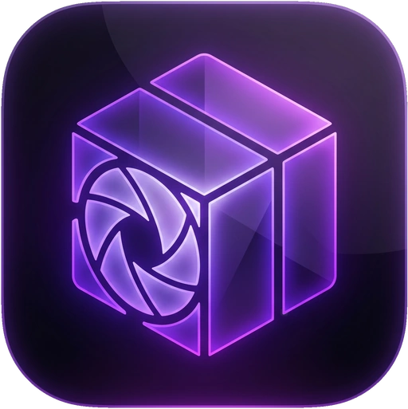
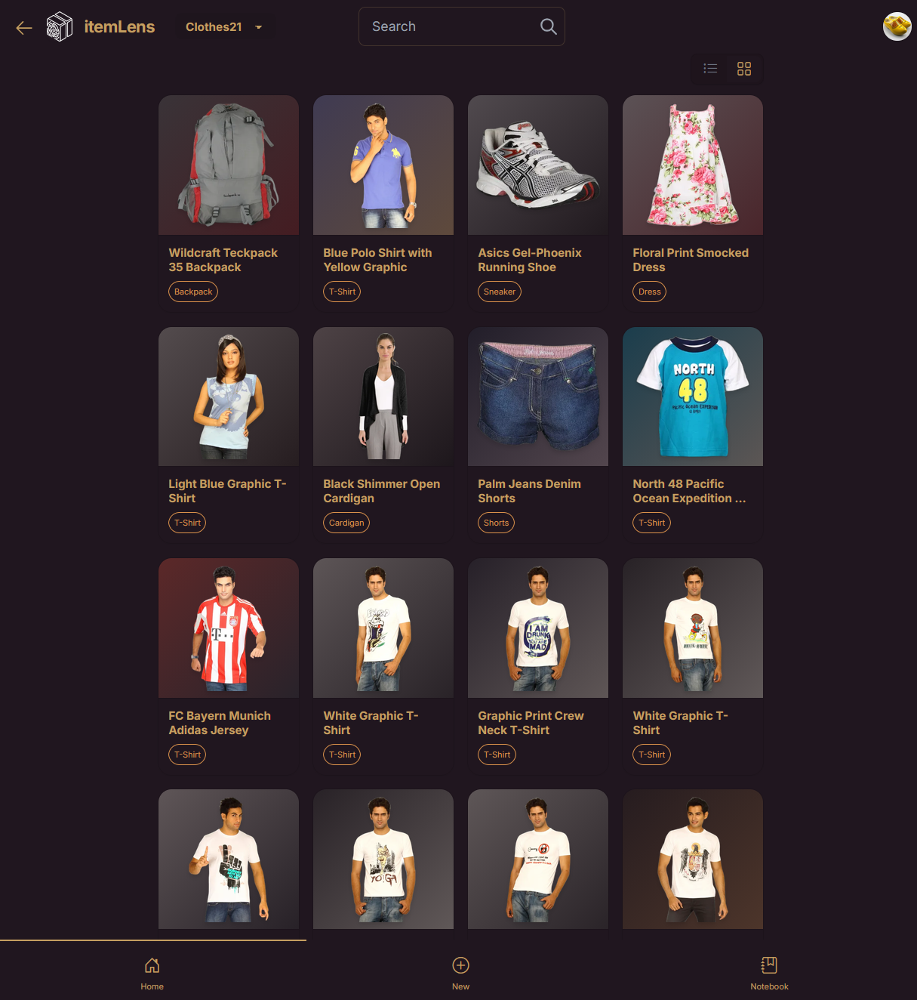
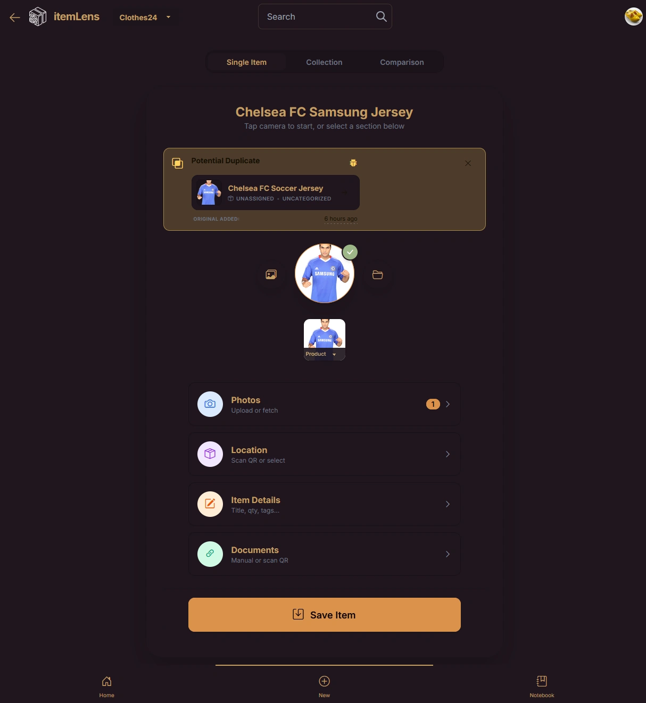
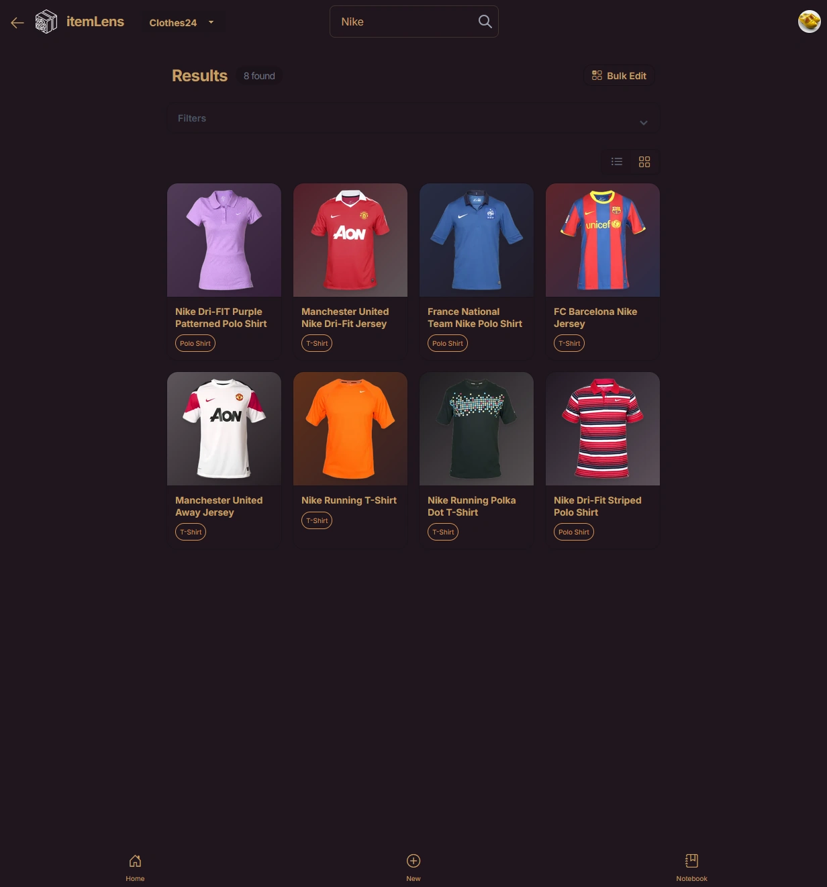

# itemLens


Inventory management (for at home). There are many like it, but this one is mine.

The primary use is:
`Do I have that, where the heck is it?` and `What does it do and why did I buy it?` [1]

I am no fan of data-entry, so, adding new products/items should be as automated as 
possible (using any device). Most of the effort of making this app went into making
a pleasant and fast work-flow. It optionally uses machine learning of various types:
language and vision models, object classification, OCR, background removal, segmentation,
TTS.

[1]: There's also a primal satisfaction in simply admiring my stuff; swimming through a hoard of tools, books, and components like Scrooge McDuck. itemLens is the digital equivalent: a way to inspect and appreciate your entire collection without having to drag 20 boxes out of the attic.

_This readme is very much a work in progress; it's currently not organized or complete at all._
_Also: Quite a few of the more recent bits are written by an LLM acting as a sales person, which is very cringe. I will deal with it._

### How to use
To add a product, grab your phone and take a picture, scan the QR-code on the container
to place it in and that's it.  

But wait... there's more.

If feeling particularly ambitious on a day, you can also:
- take a picture of an invoice/receipt (itemLens will use image classification/OCR/LLM to get the juicy bits)
- add additional photos (using camera or just paste in links)
- scan QR-codes containing URLs to relevant documents
- paste in a list of attributes (weight/color/size/etc)
- **Fuzzy Search Toggles:** Unhappy with search results? The AI stems words (e.g., "Jeans" -> "Jean") which is great for finding electronics or tools but sometimes too broad for clothes. You can toggle "Fuzzy Word Search" off per-collection in Settings for strict text matching.
- **Position Persistence:** The reader automatically saves your exact scroll position, PDF page, or EPUB location across sessions. You won't spend half your day scrolling back to where you left off.
- **Multiple Categories:** Need an item to exist in two categories? Give it multiple photos and assign a different category to each photo. The engine resolves categories at the photo level.
- **Changing Categories:** Changing the category of an item is awkward at the moment; go into the image lightbox, use the "..." menu and change the category of the item there (historically it comes from the fact that it's the *photo* that is categorized, not the item).
- **Just Paste Anything:** The global PasteHandler instantly detects images in your clipboard (uploading them to the current item), raw URLs (fetching the webpage/PDF), and text blocks (creating local Markdown notes analyzed by LLMs). Hit `Ctrl+V` anywhereitemLens!
- Fire-and-Forget Outbox Workflow: Never wait for a progress bar. Tapping 'Save' pushes the item to an offline-tolerant IndexedDB queue and resets the UI for next scan. A background worker handles the upload, meaning you can rapidly scan items in a deep garage or basement and the app will flawlessly sync whenever your Wi-Fi reconnects.
- **Knowledge Base / Second Brain:** itemLens isn't just for physical objects. Because it downloads, parses, and indexes linked articles, EPUBs, and PDFs, it doubles as a localized knowledge base for your topics and projects. The bookmark feature and making it searchable is the knowledge base version of "where is it" (entity knows how often I've gone: where did I read that...).
- never run into a dead link again, all pages you link to are downloaded and stored locally on your disk
- **Video Archiving:** If you paste a link to YouTube, Twitter, Reddit, TikTok or any other media site, itemLens uses `yt-dlp` in the background to physically download the video and archive it forever alongside your item!
- **Nudge the Vision Model:** Does it sometimes guess wrong? Look for the ✨ Sparkle icon next to the title in the item details or scan preview. Click it to provide a hint (e.g. "It's an IKEA MITTZON desk") to dramatically improve classification accuracy!
- **Scraper Limits:** itemLens attempts to fetch and summarize documents linked in text automatically, but restricts depth to one level to prevent infinite spidering. Use `httrack` or similar tools for full website archival.
- **Empty Category Cleanup:** If you delete or move the last item out of a category, itemLens will automatically vaporize the category and its associated taxonomy rules. This facilitates easy cleanup if you import an item into the wrong collection.
- **System Diagnostics:** Includes a self-diagnostic area in the Admin dashboard (`/settings/admin`) that pings host dependencies, Docker microservices, and API configurations to flag setup errors.
- add tags, amount, description, etc (but then you are obviously _very_ ambitious as it might require typing)

**Note:** You do not need expensive subscriptions (OR ANY AT ALL) to run itemLens. The free tiers for Google Gemini (15 requests/min) and Groq are generous and completely sufficient for a normal household. I have not paid a single cent during my use nor during development. Groq is utilized free analysis like in `summarizeWebpageExtract`, `extractInvoiceDataGroq`, and reverse image search parsing.

### Voice Search
I use Groq's Whisper 3 for TTS in the search field. It is ridiculously good when given context, actually. With ease we handle "USB to TTL", "ESP32 Development board", "Resistors 10k" or "I2C OLED display module" in search. It feels _very_ natural.

### Here's a text about taxonomy that will be incorporated naturally in this README one day:
We’re building a self-organizing inventory app. The basic idea is that you take a photo of any object—from a book to a winter coat to a spark plug—and the app automatically figures out what it is, what details matter, and how to file it away.

Because it has to handle a bit of everything, we can't pre-program it with rigid spreadsheet columns like "Brand" or "Shoe Size." Instead, the system creates its own structure on the fly. Doing this brings up two practical hurdles:

**Keeping the language consistent**  
Image-recognition tools are naturally a bit messy with words. If you feed the system photos of three different t-shirts, it might label one with "short sleeves," another with "arm style," and a third with "sleeve length." You can't build a useful search tool out of that. To fix this, the first time the app sees a new category, it locks in a specific set of labels and forces the software to reuse those exact terms for all future items in that group. It turns messy, fluid text into a clean, predictable database.

**Spotting duplicates from photos**  
The other challenge is figuring out if you’ve just photographed an item you already logged. Since we don't rely on barcodes, we have to use the photos themselves. If you take a picture of a jacket on your bed today, the lighting and folds will look completely different than when you first logged it hanging in a closet months ago. The system might pull the color "Navy" today instead of "Dark Blue," or it might miss a pocket. To handle this, the app mathematically cross-references the visual details and the text to figure out if it's the exact same item, ensuring it doesn't log a duplicate or confuse two completely different blue shirts.

Ultimately, we're just using modern vision and language models to handle the tedious work of standardizing and deduplicating data. It figures out how much detail is actually needed; like knowing when an item is just a "hammer" versus a "16oz fiberglass handle". Just snap a picture and let this organize it (okay, I also spammed QR-codes on a whole heap of boxes and trays, so maybe _two_ snaps, although the QR-reader does not require a tap, per se).


### Screenshot(s)
I've been waiting couple of years to actually show a screenshot because I never really did anything
about the visuals ... But, let's get the ball rolling in 2026, the first screenshot:




...and only mere days after that, a second and a third one! (whoop!):

<div>
  
  
</div>


### Features
- Paste-parser for key-value-pairs
- QR-code reading (server and client)
- Optical Character Reading (OCR)
- Image classification (Blip, Vision Models like Gemini)
- LLM Summaries (Llama3, Groq)
- Invoice/receipt data extraction
- Download-and-store documents (link-rot no more). **EPUB books are supported** and can be read inside the browser using built-in reader. You can bookmark pages or highlight text inside EPUBs, which syncs the surrounding chapter text to Notebook. This makes the exact sections of books fully searchable via Full Text Search (alongside the physical items.
- **Token & Cost Tracking:** itemLens tracks backend AI operations and token counts so you can monitor exactly how much it interacts with external APIs (visible in System Activity).
- Image processing (background removal, thumbnail, etc)
- Color extraction
- Collection (bulk) import of CDs, DVDs, books, what have you
- Multiple inventories (i.e. one for shoes, another for clothes, and yet another for electronics)
- Reminder to self: long-tap on notebook button to add a quick note without going to notebook
- ...and more

### Scanning collections
`Tip: count the items before scanning. Gives you an idea if you had a good enough picture`

*Side note: It did not take me more than an hour or two to scan 16 cardboard boxes full of books. The unpacking and packing the books back into the box was the time-consuming part.*


__this is so cringe -- I the human should rewrite this -- now here as reminder__ 
### Bulk Import & The Comparison Lens (Set Operations) *[ALPHA/TESTING]*

The **Entity-Attribute-Value (EAV) Taxonomy** automatically tailors schemas based on your collection's archetype. It intuitively knows that a t-shirt needs a "Garment Style" and "Fabric", while a drill requires a "Form Factor" and "Power Delivery". It enforces strict vocabulary to eliminate search friction.

When it comes to putting that data to work, you can rely on the **Comparison Lens**.
If bulk import is how you ingest a mountain of data into itemLens in one go, the **Comparison Lens** is how you actually use that data out in the real world against physical shelves, crates, and stores without having to pick up items and scan barcodes one-by-one.

It performs set math between what your camera sees (**Set A**) and what your database holds (**Set B**).

#### Digital Books & Documentation
Create a virtual container named **"Digital Library"** and assign tech books, spec sheets, or EPUBs/PDFs there. When you drop an EPUB or PDF into an item, itemLens automatically extracts the embedded cover art, `og:image`, or first page to use as the primary thumbnail. The item card gives you a direct **"Read"** button to view and study the document inside the browser.

#### Practical Examples & Workflows
- **Discovery / Flea Market Scan (What do I not own? / $A \setminus B$):** 
  - *Scenario:* You're at a record store or thrift shop looking at a crate of 40 CDs or John Sandford paperbacks. 
  - *Action:* Snap one photo of the shelf.
  - *Result:* The app cross-references your database and splits the items into **✨ New to You** (stuff you don't own yet) and **✓ In Your Collection** (stuff you already own, complete with its exact storage container).
- **Audit / Kit Check (What am I missing from my baseline? / $B \setminus A$):** 
  - *Scenario:* You're packing for a camping trip or checking your electronics workbench. 
  - *Action:* Scope the comparison to tag `#camping-gear` or container `A 001`, dump your gear on the table, and snap a photo. 
  - *Result:* The app flags what's **⚠️ Missing from List** and tells you where it was last logged.
- **Subset Scoping:** Instead of checking against your entire database every time, you can scope comparisons to specific subsets:
  - By Tag (e.g., `#canned-veggie`, `#ps2-games`)
  - By Location/Container (e.g., `Box A 001`)
- **Triage Actions:** When you spot something missing that you want to track, the **Add** menu lets you route it straight to **Collection**, your **Shopping List**, or **To-Do List** in the Notebook (for current Collection).

### Random note to refine in the future
**The Knowledge Base of Your Stuff:** We've blurred the lines between a strict inventory tracker and a personal knowledge base. By integrating an overarching Notebook and automatically downloading linked articles/manuals, itemLens isn't just about *where* an item is, but capturing the ideas, projects, and context surrounding it.

### Info how I use itemLens
- TODO: 
    - Which label printer
    - Which cabinets
    - Pictures of containers
    - Firefox QR-code generator for current link
    - I use it for electronics/components
    - Which fields I actually fill in
    - How I search for related links
    - **Note on Terminology:** While itemLens is an *inventory management* system, the UI refers to the top-level databases as "Collections". The bulk camera feature is named "Multi-Scan", and the underlying database schema retains the name "Inventories" for structural stability. I mention this because there is bound to be confusion before all variables are renamed. Especially since there was a "collection" before (which is now multi-scan).
# Third parties
I really dislike it when I have to register for some 3rd party services to try out some software,
therefore, that is all voluntary. Set the flag `NO_THIRD_PARTY_SERVICES` to `true` in `.env` 
and you can use it all -- but adding new products will be more work.

### About third party services and incurred costs
Goal is: No fixed cost / month -- only pay for use

# ARRRGH's
You may need to do this after `npm install` if you get `Error: Cannot find module '../build/Release/canvas.node'`:
```
$ cd node_modules/canvas
$ npx node-gyp rebuild
```

Prisma error? Deleted node_modules?
```
$ npx prisma generate
```

# Development

## Stack
SvelteKit 2, PWA, Prisma, SQLite, Tailwind CSS, TypeScript, LLMs + various ML models.


## Installing

### Get it:
```bash
npx degit romland/itemLens itemLens
```

### Create some directories
```bash
mkdir `static/images`
mkdir `static/images/u`
```

### Fill in your details in .env
```bash
cp .env.example .env
```

### Run for development:
```bash
cd sveltekit-starter
npm install
npm run dev
```

### Database migration:
```bash
npx prisma migrate dev --name init
```

### Database seeding:
```bash
npx prisma db seed
```

### Use default user:
```
Username: admin
Password: password
```

### Build for production
```bash
npm run build
```

### Safari Share Target
Apple limitation: **iOS Safari does not support the Web Share Target API.**
Apple only allows PWAs to *send* shares out, not *receive* them natively via the share sheet.

### The Workaround: iOS Shortcuts

If you want to share things directly into itemLens on an iPhone, the best workaround is to build a quick iOS Shortcut:
1. Open the **Shortcuts** app on your iPhone and create a new shortcut.
2. Tap the **(i)** icon at the bottom and turn on **Show in Share Sheet**.
3. Set it to accept **URLs, Text, and Images**.
4. Add an action to **URL Encode** the shortcut input.
5. Add an action to **Open URLs**, and construct the URL to point to your app's capture route with the encoded input attached as a query parameter (e.g., `[https://dev.providi.nl/timeline?pasteText=](https://dev.providi.nl/timeline?pasteText=)[Encoded Input]`).


### Host Dependencies (Optional)
All external dependencies are **100% optional**. Everything in itemLens gracefully falls back if a tool isn't installed.

* **PDF Covers:** `sudo apt-get install poppler-utils` (provides `pdftoppm` to extract PDF first pages as thumbnails)
* **Video Thumbnails:** `sudo apt-get install ffmpeg` (extracts frame grabs from video files)
* **Video Archiving:** `yt-dlp` (downloads linked videos from YouTube, Twitter, etc. into local storage)

Check `/settings/admin` at any time to run a self-diagnosis on host tools, Docker microservices (RemBG, PaddleOCR, SingleFile), and API keys.

# Latest yt-dlp
```
Do this
  P="$(which yt-dlp)" && sudo wget https://github.com/yt-dlp/yt-dlp/releases/latest/download/yt-dlp -O "$P" && sudo chmod a+rx "$P"

OR:
  which yt-dlp
      > make sure wget puts it here THAT_PATH
  sudo wget https://github.com/yt-dlp/yt-dlp/releases/latest/download/yt-dlp -O THAT_PATH/yt-dlp
  sudo chmod a+rx THAT_PATH/yt-dlp
```

# TODO / notes
- fetching interesting links (especially documentation/specs) for newly items should also be automatic

# TODO README:
- Screenshot(s), video(s)
- need to document that you can hold down "Notepad" button to add a new note without leaving current context
